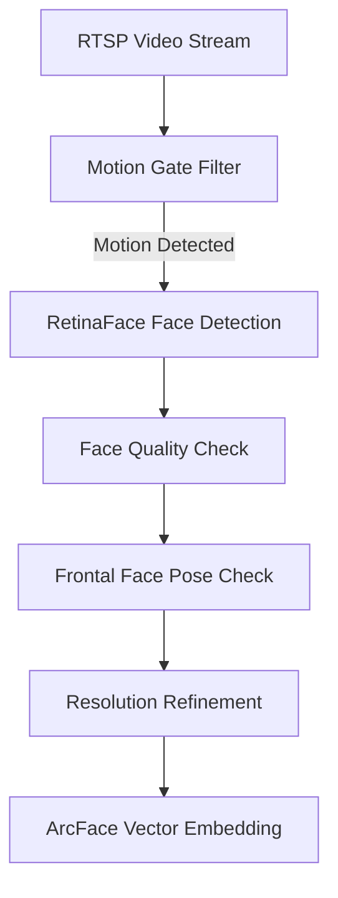

# 🛡️ EPIC Face Detection & Authorization: Technical Specification

This document provides a comprehensive technical overview of the facial recognition, detection, and authorization system implemented in the **EPIC (Employee Performance Insight Compliance)** platform.

---

## 1. Core Technology Stack

The system utilizes an event-driven, GPU-accelerated microservices architecture designed to decouple heavy computer vision inference from web requests.

| Layer | Component / Library | Details & Version |
| :--- | :--- | :--- |
| **Deep Learning Framework** | PyTorch | `torch==2.1.0+cu118` (Forced GPU acceleration via CUDA 11.8) |
| **ONNX Runtime** | ONNX Runtime GPU | `onnxruntime-gpu==1.17.1` (Direct CUDA execution provider) |
| **Computer Vision Engine** | OpenCV & NumPy | `opencv-contrib-python<4.11`, `numpy<2.0` |
| **AI Models (Object/Person)** | Ultralytics YOLOv8 | `yolov8n.pt` (Person), `yolov8x_weapons.pt` (Weapons), `yolov8n_mobile.pt` (Mobiles) |
| **AI Models (Biometrics)** | InsightFace (`buffalo_l`) | Includes RetinaFace (Detection) & ArcFace (Recognition) |
| **State Synchronizer / Cache** | Redis | Real-time Pub/Sub and caching for camera streams and presence states |
| **Database** | PostgreSQL | Handles persistent staff accounts and vector similarity indexing |
| **Frontend Rendering** | React / TypeScript | Real-time Canvas overlay at 30 FPS via WebSockets / Socket.IO |

---

## 2. Face Detection Pipeline

Face detection is processed via the **InsightFace** sub-framework (utilizing a **RetinaFace** backbone with a ResNet50 equivalent model topology).



### Key Preprocessing Techniques:
1. **OpenCV Motion Gate**: Grayscale frame-differencing checks if movement exceeds the `MOTION_GATE_THRESHOLD` before triggering YOLO or Face detection. This reduces idle CPU/GPU load.
2. **Dynamic Resolution Refinement**: 
   * Small or distant faces (< 100px width) undergo **50% padding expansion**.
   * The crop is upscaled to **224x224** using bicubic interpolation (`cv2.INTER_CUBIC`).
   * The upscaled image is re-processed to generate a high-definition feature embedding, maximizing recognition distance.

---

## 3. Biometric Verification & Quality Gates

To prevent false enrollments and inaccurate scans, every detected face must pass through three biometric gates:

### A. Image Quality Gate
Calculates a quality score blending detection confidence, blurriness, and illumination:
* **Sharpness (Blur Check)**: Measured via Laplacian variance of the face crop (`cv2.Laplacian(gray).var()`). Minimum blur threshold is size-aware (8.0 for small faces, up to 25.0 for large crops).
* **Illumination (Brightness Check)**: Average grayscale value. Rejected if the crop is too dark (< 15.0) or over-exposed (> 255.0).
* **Overall Score**: Weighted as `(det_score * 0.4) + (blur_score * 0.4) + (pose_score * 0.2)`. Must exceed 0.4 for static registrations and 0.2 for video registrations.

### B. Frontal Face Pose Validation (3D Head Rotation)
Ensures the face is looking directly at the camera.
* **3D Head Pose Estimation**: Computes angles of rotation:
  * **Yaw** (Side-to-Side rotation): Max Allowed = **±45.0°**
  * **Pitch** (Up-and-Down tilt): Max Allowed = **±35.0°**
  * **Roll** (Tilted head angle): Max Allowed = **±30.0°**
* **2D Landmark Symmetry Fallback**: If 3D head pose estimation is unavailable, calculates nose-to-eye horizontal distance ratio (maximum allowed ratio = **1.7**) and nose-to-mouth vertical distance ratio (maximum allowed ratio = **2.0**).

### C. Liveness Detection & Anti-Spoofing (Passive)
A built-in passive anti-spoofing mechanism protects against presentation attacks (phones, printed paper):
1. **FFT Moire Detection**: Computes a 2D Fast Fourier Transform (FFT) on the face crop to isolate screen refresh pattern frequencies. If the High/Low frequency energy ratio > **0.65**, it flags a screen playback attack.
2. **YCrCb Color space Chrominance Analysis**: Analyzes chrominance variance of the Cr and Cb color components.
   * If variance > **350**, it flags screen chrominance (digital screens).
   * If variance < **0.5**, it flags zero-variance print paper (printed photos).
   * *Note: Liveness analysis is implemented but bypassed (`return True`) in default settings to support standard IP cameras.*

---

## 4. Face Recognition & Vector Matching

Once a face crop passes the quality gates, it is transformed into a **512-dimensional vector embedding** using the **ArcFace** network.

### A. Distance-Aware Cosine Similarity
The system matches the runtime embedding against registered embeddings using **Cosine Similarity**:

$$\text{Cosine Similarity} = \frac{\mathbf{A} \cdot \mathbf{B}}{\|\mathbf{A}\| \|\mathbf{B}\|}$$

To minimize false positives due to perspective distortion, the similarity threshold is dynamically adjusted based on the bounding box size (representing distance from the camera):
* **Far View** (Face Bounding Box < 60px): Threshold = **0.48** (Relaxed to allow distant recognition)
* **Mid View** (Face Bounding Box 60px to 150px): Threshold = **0.52** (Standard balanced configuration)
* **Near View** (Face Bounding Box > 150px): Threshold = **0.55** (Stricter matching for close-up verification)
* **Hard Fallback Limit**: If no match is found above the dynamic thresholds, any match scoring **>= 0.40** is allowed as a secondary fallback.

### B. Two-Tiered Matching Architecture
1. **Primary - Database Vector Search**: Executes high-performance search directly in PostgreSQL using a vector similarity query:
   ```sql
   SELECT se.staff_id, s.name, 1 - (se.embedding <=> %s::vector) AS similarity 
   FROM staff_embeddings se
   JOIN staff s ON se.staff_id = s.staff_id
   ORDER BY se.embedding <=> %s::vector LIMIT 1
   ```
2. **Secondary - In-Memory Fallback Cache**: If the database is busy or unavailable, the system runs local NumPy matrix operations against a cached `known_encodings` dictionary loaded from serialized archive pickles.

---

## 5. Attendance & Authorization State Machine

To translate visual matches into logical attendance actions, the system implements a strict, transaction-safe database state machine:

* **Checks & Balances**:
  * **Cooldown Limit**: Prevents logging duplicate checks. Set to **15.0 seconds** for generic camera feeds, and **0.5 seconds** for dedicated entry/exit devices.
  * **Automatic Self-Healing**: On check-in, the system queries for any open sessions from previous calendar days. If found, it automatically closes them at the previous day's shift end time or a 10:00 PM default fallback to prevent session leakage.
  * **Shift Late Threshold**: Compares check-in timestamps with the employee's `shift_start_time`. If the check-in is more than 15 minutes past the start time, the daily attendance session is automatically tagged as `'Late'`.
  * **Privacy Retention Policy**: Automatically prunes historical attendance snapshots older than **30 days** and raw database logs older than **90 days**.

---

## 6. Accuracy & Performance Benchmarks

### Accuracy Metrics
The core biometric neural networks are trained on global face datasets:
* **ArcFace Backbone**: Achieves **99.82%** verification accuracy on the LFW (Labeled Faces in the Wild) benchmark.
* **Underlying Embedding Space**: Genuine matching pairs cluster between `0.65` and `0.90` cosine similarity. Impostor/stranger profiles score consistently below `0.45`, preventing unauthorized access.

### Performance Controls
* **Multi-threaded Worker Isolation**: The `vision_worker.py` runs independently from the REST API to isolate GPU usage.
* **Global Inference Semaphore**: Limits concurrent GPU operations to **4** parallel threads to prevent GPU out-of-memory (OOM) crashes.
* **Dynamic Skipping**: Drops frames dynamically if the camera FPS exceeds the GPU inference capacity, maintaining real-time latency.
